# Service - Aplicação de Processamento de Vídeo

Este módulo provisiona a aplicação principal de processamento de vídeo no Kubernetes (EKS) com integração com ECR, S3, e todos os serviços de infraestrutura.

## 📋 Visão Geral

A aplicação é configurada como um deployment no Kubernetes com:
- **Containerização**: Imagem Docker no ECR
- **Armazenamento**: S3 para uploads e outputs
- **Autoscaling**: HPA (Horizontal Pod Autoscaler)
- **Load Balancer**: Service do tipo LoadBalancer
- **Integração**: RabbitMQ, Redis, PostgreSQL
- **Monitoramento**: Health checks e métricas

## 🏗️ Arquitetura

```mermaid
graph TB
    subgraph "AWS EKS"
        subgraph "Namespace: video-processor"
            subgraph "Deployment"
                POD1[Pod 1<br/>video-processor]
                POD2[Pod 2<br/>video-processor]
                POD3[Pod N<br/>video-processor]
            end
            
            SERVICE[Service<br/>LoadBalancer]
            HPA[HPA<br/>Autoscaling]
            
            subgraph "ConfigMaps"
                CM_APP[App Config]
                CM_DB[DB Init Config]
            end
            
            subgraph "Secrets"
                SEC_ECR[ECR Secret]
                SEC_APP[App Secret]
            end
            
            SA[Service Account<br/>IAM Role]
        end
    end
    
    subgraph "AWS Services"
        ECR[ECR Repository<br/>fiap-hack-production]
        S3[S3 Bucket<br/>fiap-hackaton-files-1]
        IAM[IAM Role<br/>Service Account]
    end
    
    subgraph "External Services"
        RABBITMQ[RabbitMQ<br/>Message Queue]
        REDIS[Redis<br/>State Cache]
        POSTGRES[PostgreSQL<br/>Database]
    end
    
    %% Connections
    ECR --> POD1
    ECR --> POD2
    ECR --> POD3
    
    SERVICE --> POD1
    SERVICE --> POD2
    SERVICE --> POD3
    
    HPA --> POD1
    HPA --> POD2
    HPA --> POD3
    
    S3 --> POD1
    S3 --> POD2
    S3 --> POD3
    
    IAM --> SA
    
    RABBITMQ --> POD1
    RABBITMQ --> POD2
    RABBITMQ --> POD3
    
    REDIS --> POD1
    REDIS --> POD2
    REDIS --> POD3
    
    POSTGRES --> POD1
    POSTGRES --> POD2
    POSTGRES --> POD3
    
    %% Styling
    classDef pod fill:#e3f2fd,stroke:#1976d2,stroke-width:2px
    classDef service fill:#fff3e0,stroke:#f57c00,stroke-width:2px
    classDef config fill:#e8f5e8,stroke:#388e3c,stroke-width:2px
    classDef aws fill:#ffebee,stroke:#d32f2f,stroke-width:2px
    classDef external fill:#f3e5f5,stroke:#7b1fa2,stroke-width:2px
    
    class POD1,POD2,POD3 pod
    class SERVICE,HPA service
    class CM_APP,CM_DB,SEC_ECR,SEC_APP,SA config
    class ECR,S3,IAM aws
    class RABBITMQ,REDIS,POSTGRES external
```



## 🚀 Deploy

### Pré-requisitos

- Cluster EKS configurado e funcionando
- kubectl configurado para o cluster
- AWS CLI configurado
- Terraform instalado
- Docker instalado

### Deploy Automático (GitHub Actions)

O deploy é executado automaticamente via GitHub Actions quando há push para a branch `main`:

```yaml
# .github/workflows/deploy.yml
- Validação do Terraform
- Build e push da imagem Docker para ECR
- Geração do plano Terraform
- Aplicação das mudanças no Kubernetes
- Verificação do deployment
- Teste de health check
```

### Deploy Manual

```bash
# Deploy completo (ECR + Kubernetes)
make deploy

# Apenas build e push para ECR
make deploy-ecr-only

# Apenas deploy no Kubernetes
make deploy-k8s-only

# Deploy completo incluindo criação do EKS
make deploy-eks
```

## ⚙️ Configuração

### Variáveis Principais

| Variável | Descrição | Padrão |
|----------|-----------|--------|
| `app_name` | Nome da aplicação | `video-processor` |
| `app_namespace` | Namespace Kubernetes | `video-processor` |
| `app_image` | Imagem Docker | `fiap-hack/video-processor:latest` |
| `app_replicas` | Número de réplicas | `2` |
| `aws_region` | Região AWS | `us-east-1` |
| `environment` | Ambiente | `production` |
| `project_name` | Nome do projeto | `fiap-hack` |

### Recursos Criados

| Recurso | Quantidade | Descrição |
|---------|------------|-----------|
| ECR Repository | 1 | Repositório de imagens Docker |
| S3 Bucket | 1 | Armazenamento de arquivos |
| IAM Role | 1 | Permissões para Service Account |
| Kubernetes Namespace | 1 | Namespace da aplicação |
| Kubernetes Deployment | 1 | Deployment da aplicação |
| Kubernetes Service | 1 | LoadBalancer |
| Kubernetes HPA | 1 | Autoscaling |
| ConfigMaps | 2 | Configurações da aplicação |
| Secrets | 2 | Credenciais e secrets |

## 🔧 Comandos Úteis

### Makefile

```bash
# Ajuda
make help

# Build e Deploy
make build              # Build local
make build-ecr          # Build para ECR
make deploy             # Deploy completo
make deploy-eks         # Deploy + criar EKS

# ECR
make login-ecr          # Login no ECR
make push-ecr           # Push para ECR

# Terraform
make terraform-init     # Inicializar Terraform
make terraform-plan     # Gerar plano
make terraform-apply    # Aplicar mudanças
make terraform-destroy  # Destruir recursos

# Kubernetes
make k8s-status         # Status dos recursos
make k8s-logs           # Logs da aplicação
make k8s-describe       # Descrever recursos
make k8s-port-forward   # Port forward
make k8s-scale          # Escalar deployment
make k8s-restart        # Reiniciar deployment

# Desenvolvimento
make dev-build          # Build para desenvolvimento
make dev-run            # Executar localmente
make dev-stop           # Parar containers

# Serviços
make get-rabbitmq-credentials  # Credenciais RabbitMQ
make get-rabbitmq-status       # Status RabbitMQ
make get-service-url           # URL do LoadBalancer
```

### kubectl

```bash
# Ver pods da aplicação
kubectl get pods -n video-processor

# Ver services
kubectl get svc -n video-processor

# Logs da aplicação
kubectl logs -f deployment/video-processor -n video-processor

# Descrever deployment
kubectl describe deployment video-processor -n video-processor

# Escalar deployment
kubectl scale deployment video-processor --replicas=3 -n video-processor

# Port forward
kubectl port-forward service/video-processor-service 8080:80 -n video-processor
```

### AWS CLI

```bash
# Verificar ECR
aws ecr describe-repositories --repository-names fiap-hack-production

# Verificar S3
aws s3 ls s3://fiap-hackaton-files-1

# Verificar IAM Role
aws iam get-role --role-name fiap-hack-production-service-account-role
```

## 🔗 Conectividade

### LoadBalancer

```bash
# Obter URL do LoadBalancer
kubectl get svc video-processor-service -n video-processor -o jsonpath='{.status.loadBalancer.ingress[0].hostname}'

# Testar health check
curl http://<loadbalancer-url>/health
```

### Port Forward (Desenvolvimento)

```bash
# Port forward para acesso local
kubectl port-forward service/video-processor-service 8080:80 -n video-processor

# Acessar localmente
curl http://localhost:8080/health
```

## 🔒 Segurança

### IAM Role

A aplicação usa IAM Role para Service Account com permissões para:
- **S3**: GetObject, PutObject, DeleteObject, ListBucket
- **ECR**: GetAuthorizationToken, BatchCheckLayerAvailability, GetDownloadUrlForLayer

### Secrets

```bash
# ECR Secret
kubectl get secret ecr-secret -n video-processor

# App Secret
kubectl get secret app -n video-processor
```

## 📊 Monitoramento

### Health Checks

- **Liveness Probe**: HTTP GET `/health`
- **Readiness Probe**: HTTP GET `/health`
- **Initial Delay**: 30s (liveness), 5s (readiness)

### Autoscaling

```bash
# Verificar HPA
kubectl get hpa -n video-processor

# Verificar métricas
kubectl top pods -n video-processor
```

### Logs

```bash
# Logs da aplicação
kubectl logs -f deployment/video-processor -n video-processor

# Logs de um pod específico
kubectl logs -f <pod-name> -n video-processor

# Logs com timestamps
kubectl logs --timestamps deployment/video-processor -n video-processor
```

## 🔄 Atualizações

### Rolling Update

```bash
# Atualizar imagem
kubectl set image deployment/video-processor video-processor=novo-tag -n video-processor

# Verificar rollout
kubectl rollout status deployment/video-processor -n video-processor

# Rollback se necessário
kubectl rollout undo deployment/video-processor -n video-processor
```

### Terraform

```bash
# Atualizar configuração
cd terraform && terraform plan
cd terraform && terraform apply
```
